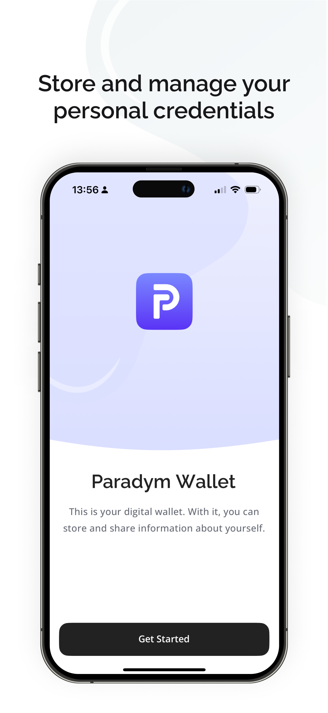
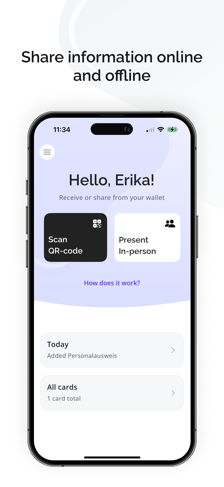
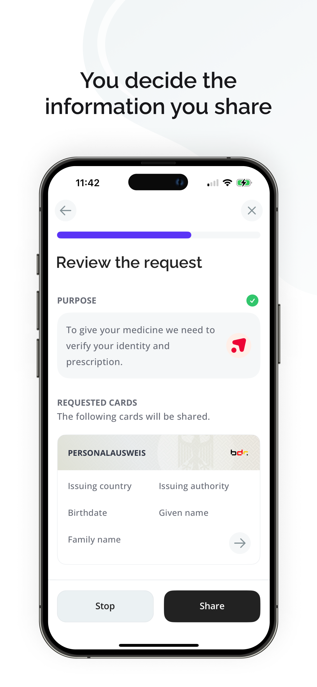
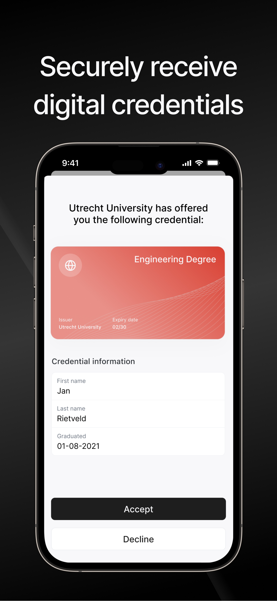
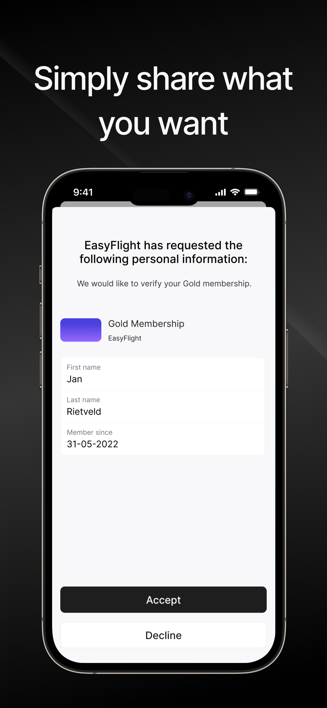

<div align="center">
   
</div>

<h1 align="center"><b>Paradym Wallet</b></h1>

🚀 Welcome to the Paradym Mobile Wallet repository!

The Paradym Mobile Wallet is a digital identity wallet developed as a companion to the [Paradym platform](https://paradym.id/). It supports both EUDI and global standards. See the full overview of the current supported standards and protocols [here](https://paradym.id/products/paradym-mobile-wallet).

> The Paradym wallet can be downloaded directly from the app store ([iOS](https://apps.apple.com/nl/app/paradym-wallet/id6449846111?l=en), [Android](https://play.google.com/store/apps/details?id=id.paradym.wallet)), or the code in this repository can be adapted. The wallet is also available as a [whitelabel solution](mailto:ana@paradym.id). 

<div align="center">
<<<<<<< HEAD
  
  
  
=======
  
  
  
>>>>>>> 0fc674ab96a4cc1f135e490830ff94a2bdafa4ca
</div>

<p align="center"><i>Impression of Paradym Wallet</i></p>

<<<<<<< HEAD
With Paradym Wallet, you can seamlessly manage and present your digital credentials, allowing for a secure and private digital existence. Your data is stored locally on your device, meaning that you retain full control over your information and decide who you want to share it with.

> **Note:** 
> This repository contains both the main (stable) Paradym wallet, and a more experimental EUDI Prototype app. To read more about the Animo EUDI wallet prototype, look in the [EasyPID app directory](apps/easypid).
=======
> **Note:** 
> To read more about the Animo EasyPID EUDI wallet prototype, look in the [EasyPID app directory](apps/easypid).
>>>>>>> 0fc674ab96a4cc1f135e490830ff94a2bdafa4ca

## Try it out

You can download Paradym Wallet from the [Google Play Store](https://play.google.com/store/apps/details?id=id.paradym.wallet) or [Apple App Store](https://apps.apple.com/nl/app/paradym-wallet/id6449846111?l=en).

You can test out the wallets in these environments (as well as any solution that issues and/or verifies credentials according to the supported standards):

- [Paradym Issuer/Verifier platform](https://paradym.id/sign-up). Test out how the Paradym wallet looks and feels using the Paradym free tier. 
- [EUDI Playground](https://funke.animo.id/). Test out several pre-configured flows based on the main EUDI use cases.


## Project Structure

The project is a monorepo managed using **pnpm**, which contains an **Expo React Native** application. The UI is built using **Tamagui**, and navigation is handled using **Expo Router, React Navigation and Solito**. For the Agent and SSI capabilities **Aries Framework JavaScript (AFJ)** is used.

The folder structure is as follows

- `apps` top level applications
  - `paradym` Paradym Wallet - react native app for iOS & Android
  - `easypid` EasyPID Wallet - react native app for iOS & Android
- `packages` shared packages
  - `ui` includes our custom UI kit that will be optimized by Tamagui
  - `agent` includes the Aries Framework JavaScript (AFJ) agent and SSI capabilities
  - `app` you'll be importing most files from `app/`
    - `features` (don't use a `screens` folder. organize by feature.)
    - `provider` (all the providers that wrap the app, and some no-ops for Web.)
    - `navigation` This folder contains navigation-related code for RN. You may use it for any navigation code, such as custom links.

You can add other folders inside of `packages/` if you know what you're doing and have a good reason to.

## 🏁 Start a wallet

First, start by installing all dependencies by running `pnpm install`.

Once all dependencies are installed, you need to make sure you have a development build of the app on your mobile device.
You can install this using the following commands:

```sh
cd apps/paradym # or apps/easypid
pnpm prebuild
pnpm ios # or android
```

You only need to install the development build when **native** dependencies change. If you're only working on JS, you can skip this step if you already have the development build installed.

Once installed you can run `pnpm start` from the root of the project to start your development server.

## 📦 Releasing

🚧 Soon documentation will be added on how to publish a new release to the Apple App Store and Google Play Stores. 🚧

## 🆕 Add new dependencies

### Pure JS dependencies

If you're installing a JavaScript-only dependency that will be used across platforms, install it in `packages/app`:

```sh
cd packages/app
pnpm add date-fns
cd ../..
pnpm
```

### Native dependencies

If you're installing a library with any native code, you must install it in `expo`:

```sh
cd apps/paradym
pnpm add react-native-reanimated
cd ..
pnpm
```

You can also install the native library inside of `packages/app` if you want to get autoimport for that package inside of the `app` folder. However, you need to be careful and install the _exact_ same version in both packages. If the versions mismatch at all, you'll potentially get terrible bugs. This is a classic monorepo issue. You can use `lerna-update-wizard` to help with this (you don't need to use Lerna to use that lib).
