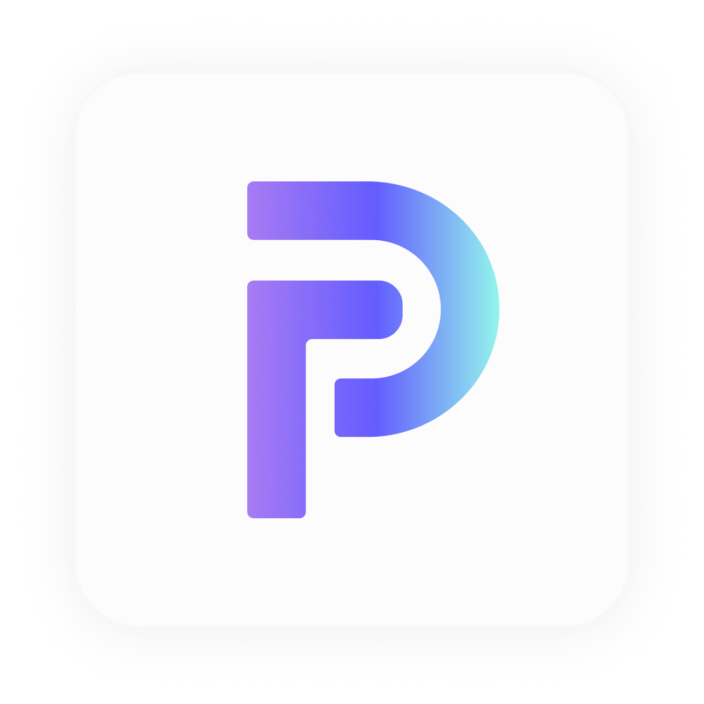
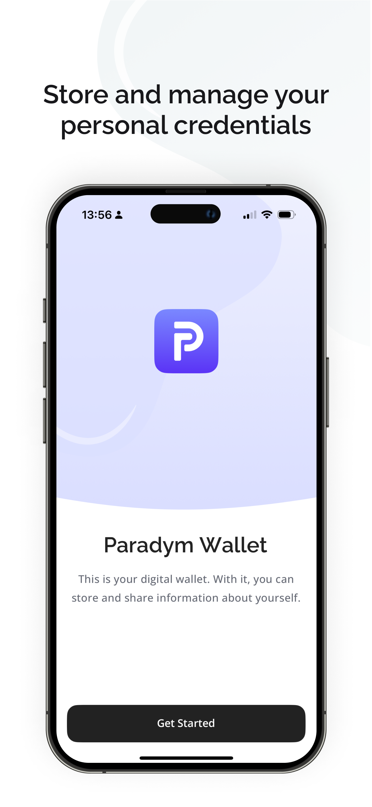
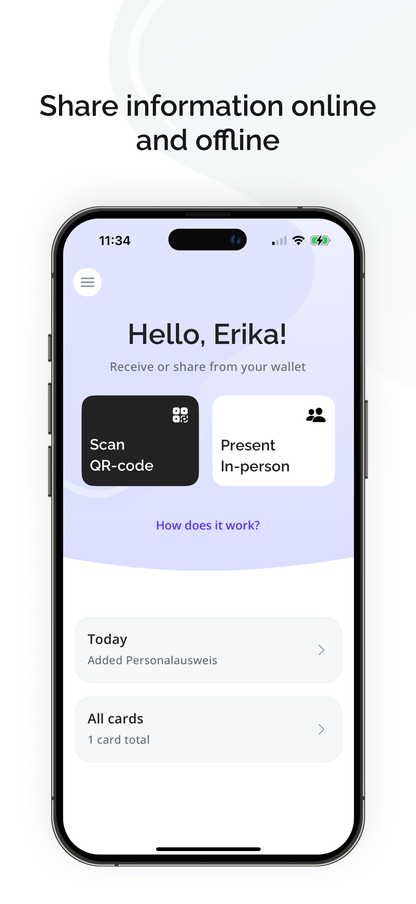
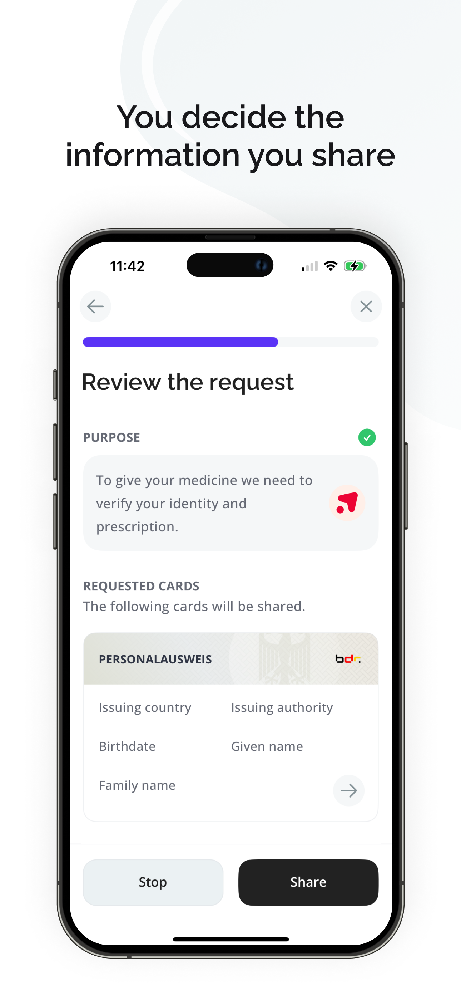

<div align="center">
   
</div>

<h1 align="center"><b>Paradym Wallet</b></h1>

🚀 Welcome to the Paradym Mobile Wallet repository!

The Paradym Mobile Wallet is a digital identity wallet developed as a companion to the [Paradym platform](https://paradym.id/). It supports both EUDI and global standards. See the full overview of the current supported standards and protocols [here](https://paradym.id/products/paradym-mobile-wallet).

> The Paradym wallet can be downloaded directly from the app store ([iOS](https://apps.apple.com/nl/app/paradym-wallet/id6449846111?l=en), [Android](https://play.google.com/store/apps/details?id=id.paradym.wallet)), or the code in this repository can be adapted. The wallet is also available as a [whitelabel solution](mailto:ana@paradym.id). 

<div align="center">
  
  
  
</div>

<p align="center"><i>Impression of Paradym Wallet</i></p>

With Paradym Wallet, you can seamlessly manage and present your digital credentials, allowing for a secure and private digital existence. Your data is stored locally on your device, meaning that you retain full control over your information and decide who you want to share it with.

> **Note:** 
> This repository contains both the main (stable) Paradym wallet, and a more experimental EUDI Prototype app. To read more about the Animo EUDI wallet prototype, look in the [EasyPID app directory](apps/easypid).

## Try it out

You can download Paradym Wallet from the [Google Play Store](https://play.google.com/store/apps/details?id=id.paradym.wallet) or [Apple App Store](https://apps.apple.com/nl/app/paradym-wallet/id6449846111?l=en).

You can test out the wallets in these environments (as well as any solution that issues and/or verifies credentials according to the supported standards):

- [Paradym Issuer/Verifier platform](https://paradym.id/sign-up). Test out how the Paradym wallet looks and feels using the Paradym free tier. 
- [EUDI Playground](https://funke.animo.id/). Test out several pre-configured flows based on the main EUDI use cases.


## Project Structure

The project is a monorepo managed using **pnpm**, which contains an **Expo React Native** application. The UI is built using **Tamagui**, and navigation is handled using **Expo Router and React Navigation**. For the Agent and SSI capabilities **Credo Framework** is used.

The folder structure is as follows

- `apps` top level applications
  - `easypid` Paradym and Funke Wallet - react native app for iOS & Android
- `packages` shared packages
  - `ui` includes our custom UI kit that will be optimized by Tamagui
  - `agent` includes the Credo agent and SSI capabilities
  - `app` you'll be importing most files from `app/`
    - `features` (don't use a `screens` folder. organize by feature.)
    - `provider` (all the providers that wrap the app, and some no-ops for Web.)
    - `navigation` This folder contains navigation-related code for RN. You may use it for any navigation code, such as custom links.
  - `scanner` includes utils for scanning QR codes.
  - `secure-store` contains methods to securely store, derive and retrieve the wallet key.
  - `translations` includes utils for translations based on the Lingui package.
  - `utils` contains varied utils used across the other packages.

You can add other folders inside of `packages/` if you know what you're doing and have a good reason to.

## 🏁 Start a wallet

First, start by installing all dependencies by running `pnpm install`.

Once all dependencies are installed, you need to make sure you have a development build of the app on your mobile device. You can install this using the following commands:

```sh
cd apps/easypid
pnpm prebuild
pnpm ios # or android
```

You only need to install the development build when **native** dependencies change. If you're only working on JS, you can skip this step if you already have the development build installed.

Once installed you can run `pnpm start` from the root of the project to start your development server.

## 🔨 Building the App

The project supports three app variants, selected via the `EXPO_PUBLIC_APP_TYPE` environment variable:

| Variant | Env Value | Bundle ID | Description |
|---------|-----------|-----------|-------------|
| Paradym Wallet | `PARADYM_WALLET` | `id.paradym.wallet` | Main Paradym wallet |
| Funke Wallet | `FUNKE_WALLET` | `id.animo.ausweis` | EUDI Wallet Prototype |
| DIDx Wallet | `DIDX_WALLET` | `za.co.didx.edge.wallet` | DIDx Me Wallet Edge |

The default variant (when no env var is set) is configured in `apps/easypid/app.config.js`.

### Local Development Builds

Local builds compile on your machine using Xcode (iOS) or Android SDK. This is the fastest way to iterate during development.

```bash
cd apps/easypid

# Build and run on iOS simulator (default variant)
npx expo run:ios --simulator

# Build and run on iOS physical device
npx expo run:ios --device

# Build and run on Android emulator/device
npx expo run:android

# Build a specific app variant
EXPO_PUBLIC_APP_TYPE=DIDX_WALLET npx expo run:ios --simulator
EXPO_PUBLIC_APP_TYPE=FUNKE_WALLET npx expo run:ios --device
EXPO_PUBLIC_APP_TYPE=PARADYM_WALLET npx expo run:android
```

If you need a clean rebuild (e.g. after changing native dependencies or switching variants):

```bash
cd apps/easypid

# Clean and regenerate the native project, then build
EXPO_PUBLIC_APP_TYPE=DIDX_WALLET npx expo prebuild --clean
EXPO_PUBLIC_APP_TYPE=DIDX_WALLET npx expo run:ios --simulator
```

Once a development build is installed, you can start just the Metro bundler without rebuilding:

```bash
# From the project root
pnpm start

# Or from apps/easypid with cache clearing
cd apps/easypid
npx expo start --dev-client --clear
```

> **Note:** You only need to rebuild the native app when native dependencies change. For JS-only changes, just restart Metro.

### EAS Build (Cloud Builds)

[EAS Build](https://docs.expo.dev/build/introduction/) compiles the app on Expo's cloud servers. All build profiles are defined in `apps/easypid/eas.json`. Always run EAS commands from the `apps/easypid/` directory.

```bash
cd apps/easypid
eas build --profile <profile-name> --platform <ios|android|all>
```

#### Build Profiles

**Base** — Shared configuration inherited by all profiles. Sets Node version and Xcode image. Not directly buildable.

##### Development Profile

Creates a **dev client** build that includes the `expo-dev-client` runtime (dev menu, hot reload, inspector).

```bash
eas build --profile development --platform ios    # iOS simulator build
eas build --profile development --platform android # Android APK
```

- iOS builds for **simulator only** (due to `simulator: true`)
- Android produces a sideloadable `.apk`
- Uses `APP_VARIANT=development`, appending `.dev` to the bundle ID
- Once installed, connect via: `npx expo start --dev-client`
- Available for download from the [expo.dev](https://expo.dev) build dashboard

##### Preview Profiles (Internal Testing / QA)

Production-like builds without dev tools, distributed to registered test devices.

```bash
# Funke
eas build --profile funke-preview --platform all
eas build --profile funke-preview-simulator --platform ios  # simulator variant

# Paradym
eas build --profile paradym-preview --platform all
eas build --profile paradym-preview-simulator --platform ios

# DIDx
eas build --profile didx-preview --platform all
eas build --profile didx-preview-simulator --platform ios
```

- **Distribution:** `internal` — iOS uses ad-hoc provisioning (requires registered device UDIDs), Android produces `.apk`
- **Bundle IDs** get `.preview` suffix (e.g. `za.co.didx.edge.wallet.preview`)
- Available via shareable install links on the expo.dev dashboard
- Simulator variants add `simulator: true` for testing on iOS Simulator without a physical device

##### Production Profiles (App Store / Play Store)

Store-signed builds ready for submission.

```bash
# Funke
eas build --profile funke-production --platform all

# Paradym
eas build --profile paradym-production --platform all

# DIDx
eas build --profile didx-production --platform all
```

- **Distribution:** `store` — signed for App Store and Play Store
- **Android:** produces `.aab` (app bundle, required by Play Store), built on `large` resource class
- **autoIncrement:** version number increments automatically on each build
- Available on the expo.dev dashboard, then submitted via `eas submit`

##### Other Profiles

| Profile | Description |
|---------|-------------|
| `funke-production-local` | Funke production config but as APK (for local device testing without store submission) |
| `e2e-test` | Extends `paradym-preview` with `withoutCredentials: true` and simulator builds for CI/CD automated testing |

#### Submitting to Stores

After a production build completes, submit it to the stores:

```bash
# Submit to App Store Connect and Google Play
eas submit --profile funke-production --platform all
eas submit --profile paradym-production --platform all
```

Submit profiles are configured in the `submit` section of `eas.json`:

| Profile | iOS (App Store Connect) | Android (Google Play) |
|---------|------------------------|----------------------|
| `funke-production` | App ID `6636489314` | `internal` test track |
| `paradym-production` | App ID `6449846111` | `alpha` track |

> **Note:** There is no `submit` profile for DIDx yet. Add one to `eas.json` when ready to submit to stores.

### Build Workflow Summary

```
Local development:
  npx expo run:ios --simulator          → Build locally, fast iteration
  npx expo start --dev-client           → Start Metro, connect to installed dev client

EAS cloud builds:
  eas build --profile development       → Dev client (install once, then use Metro)
  eas build --profile *-preview         → QA/testing (internal distribution)
  eas build --profile *-production      → Store release
  eas submit --profile *-production     → Upload to App Store / Play Store
```

### Switching Between App Variants

When switching between variants (e.g. from Paradym to DIDx), you must clean and rebuild the native project:

```bash
cd apps/easypid
rm -rf ios android
EXPO_PUBLIC_APP_TYPE=DIDX_WALLET npx expo prebuild --clean
EXPO_PUBLIC_APP_TYPE=DIDX_WALLET npx expo run:ios --simulator
```

For EAS builds, the variant is automatically set by the profile's `EXPO_PUBLIC_APP_TYPE` env var — no manual switching needed.

## 📦 Releasing

Uploading builds to Appstore Connect and the Google Play Console are automated using Github Actions and Expo Build. 

Before making a release, make sure to update the `version` in the `apps/easypid/package.json`. We generally follow semver, and so for fixes we update the patch version, for new features we update the minor version, and for large refactorings we can use the major version. However we often push user-facing changes as minor and not major, as the wallet is not interacted with by a machine, so "breaking change" is hard to define.
To trigger a release of the Paradym Wallet, run the [Continuous Deployment](https://github.com/animo/paradym-wallet/actions/workflows/continuous-deployment.yaml) workflow. Make sure to:
- Set the channel to `production`
- The platform to `all` (unless you only want to release for iOS OR Android)
- App to `paradym` (or to `funke` in case you want to deploy our EUDI Wallet Prototype).

This will trigger builds in Expo, and will then automatically upload the builds to Appstore Connect and Google Play. Build numbers are automatically incremented by Expo.

Releases are automatically published as internal release on Testflight and Google Play, allowing them to be tested.

From there on you can manually create a release in the respective platforms (of which plentry documentation can be found online).

## 🆕 Add new dependencies

### Pure JS dependencies

If you're installing a JavaScript-only dependency that will be used across platforms, install it in `packages/app`:

```sh
cd packages/app
pnpm add date-fns
cd ../..
pnpm
```

### Native dependencies

If you're installing a library with any native code, you must install it in `expo`:

```sh
cd apps/easypid
pnpm add react-native-reanimated
cd ..
pnpm
```

You can also install the native library inside of `packages/app` if you want to get autoimport for that package inside of the `app` folder. However, you need to be careful and install the _exact_ same version in both packages. If the versions mismatch at all, you'll potentially get terrible bugs. This is a classic monorepo issue. You can use `lerna-update-wizard` to help with this (you don't need to use Lerna to use that lib).
