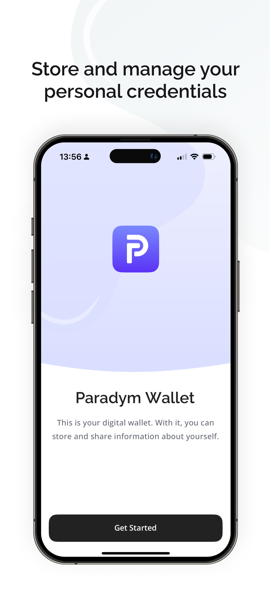
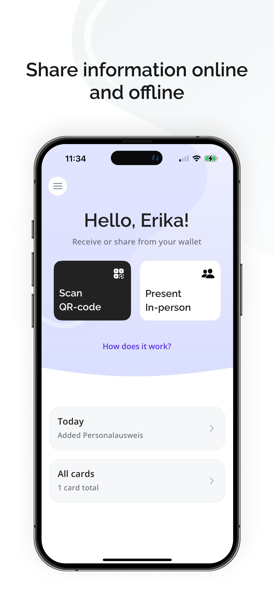
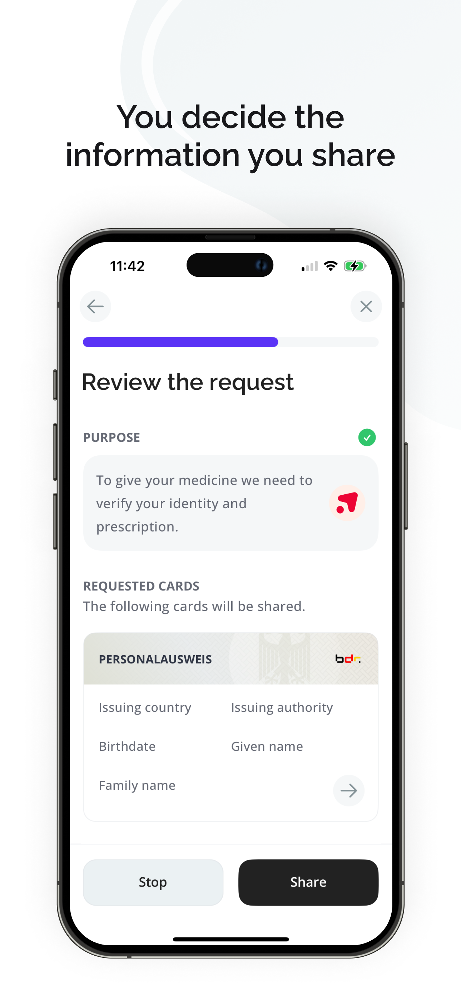

   

<h1 align="center"><b>Paradym Wallet</b></h1>

🚀 Welcome to the Paradym Mobile Wallet repository!

The Paradym Mobile Wallet is a digital identity wallet developed as a companion to the [Paradym platform](https://paradym.id/). It allows you to receive, store and present digital credentials, supporting both EUDI and global standards. Your data is stored locally on your device, meaning that you retain full control over your information and decide who you want to share it with.

> The Paradym wallet can be downloaded directly from the app store ([iOS](https://apps.apple.com/nl/app/paradym-wallet/id6449846111?l=en), [Android](https://play.google.com/store/apps/details?id=id.paradym.wallet)), or the code in this repository can be adapted. The wallet is also available as a [whitelabel solution](mailto:ana@paradym.id).

  
  
  

<i>Impression of Paradym Wallet</i>

This repository contains two wallet variants, built from the same codebase:

- **Paradym Wallet** — the main (stable) wallet, published in the app stores.
- **Funke / EUDI Wallet** — a more experimental EUDI Wallet prototype, originally built for the [SPRIND Funke ‘EUDI Wallet Prototypes’ challenge](https://www.sprind.org/en/challenges/eudi-wallet-prototypes/).

Both variants live in the same Expo app in [`apps/easypid`](apps/easypid) — see its [README](apps/easypid/README.md) for development documentation.

## Try it out

You can download Paradym Wallet from the [Google Play Store](https://play.google.com/store/apps/details?id=id.paradym.wallet) or [Apple App Store](https://apps.apple.com/nl/app/paradym-wallet/id6449846111?l=en).

You can test out the wallets in these environments (as well as any solution that issues and/or verifies credentials according to the supported standards):

- [Paradym Issuer/Verifier platform](https://paradym.id/sign-up). Test out how the Paradym wallet looks and feels using the Paradym free tier.
- [EUDI Playground](https://funke.animo.id/). Test out several pre-configured flows based on the main EUDI use cases.

## Supported standards and protocols

The SSI capabilities of the wallet are powered by [Credo](https://github.com/openwallet-foundation/credo-ts) and the [OpenID4VC TypeScript libraries](https://github.com/openwallet-foundation-labs/oid4vc-ts).

### Credential formats

| Format | Issuance | Presentation |
| --- | --- | --- |
| [SD-JWT VC](https://datatracker.ietf.org/doc/draft-ietf-oauth-sd-jwt-vc/) (incl. Type Metadata) | OpenID4VCI | OpenID4VP, Digital Credentials API |
| [mdoc / ISO 18013-5](https://www.iso.org/standard/69084.html) (incl. mDL) | OpenID4VCI | OpenID4VP, Digital Credentials API, ISO 18013-7 proximity |
| [W3C Verifiable Credentials](https://www.w3.org/TR/vc-data-model/) (v1.1 and v2.0) | OpenID4VCI | OpenID4VP |
| [AnonCreds](https://hyperledger.github.io/anoncreds-spec/) (incl. legacy Indy credentials) | DIDComm | DIDComm |

### Issuance

- [OpenID for Verifiable Credential Issuance](https://openid.net/specs/openid-4-verifiable-credential-issuance-1_0.html) — final 1.0 as well as draft 11 up to draft 15
  - Pre-authorized code flow (with transaction codes) and authorization code flow
  - Presentation during issuance
  - Batch issuance and deferred credentials
- [DIDComm Issue Credential v1 and v2](https://didcomm.org/issue-credential/2.0/)

### Presentation

- [OpenID for Verifiable Presentations](https://openid.net/specs/openid-4-verifiable-presentations-1_0.html) — final 1.0 as well as draft 21 and draft 24
  - Both [DCQL](https://openid.net/specs/openid-4-verifiable-presentations-1_0.html#name-digital-credentials-query-l) and [DIF Presentation Exchange](https://identity.foundation/presentation-exchange/spec/v2.0.0/) query languages
  - Same-device and cross-device (QR) flows
- [Digital Credentials API](https://w3c-fedid.github.io/digital-credentials/) (Android)
- [ISO/IEC TS 18013-7](https://www.iso.org/standard/82772.html) in-person proximity flows — QR and NFC device engagement, mdoc transfer over BLE
- [DIDComm Present Proof v1 and v2](https://didcomm.org/present-proof/2.0/)

### DIDComm

The Paradym Wallet variant supports [DIDComm v1](https://hyperledger.github.io/aries-rfcs/latest/concepts/0005-didcomm/) messaging, including [Out of Band invitations](https://hyperledger.github.io/aries-rfcs/latest/features/0434-outofband/), [DID Exchange](https://hyperledger.github.io/aries-rfcs/latest/features/0023-did-exchange/), and mediation via a Paradym mediator.

### Trust mechanisms

- X.509 certificates
- EUDI relying party authentication based on trusted lists
- DIDs — supported methods for resolution: `did:web`, `did:key`, `did:jwk`, `did:peer`, `did:webvh`. AnonCreds objects can be resolved via `did:cheqd`, `did:web` and `did:webvh`.

### Key management and storage

- [Askar](https://github.com/openwallet-foundation/askar-wrapper-javascript) for encrypted storage of wallet data, unlocked with a PIN-derived key or biometrics
- [Expo Secure Environment](https://github.com/animo/expo-secure-environment) for hardware-backed keys (Secure Enclave / StrongBox HSM) gated behind biometric authentication
- Cloud HSM backed by a [Wallet Service Provider](https://github.com/animo/funke-wallet-provider) (Funke/EUDI variant)

## Project structure

The project is a monorepo managed using **pnpm**, containing an **Expo React Native** application and its supporting packages. The UI is built using **Tamagui**, navigation is handled by **Expo Router**, and the agent and SSI capabilities are provided by **Credo**.

- [`apps/easypid`](apps/easypid) — the wallet app for iOS & Android, shipping both the Paradym and Funke/EUDI variants. See its [README](apps/easypid/README.md) for how to run, build and release the app.
- [`packages/sdk`](packages/sdk) — the [`@paradym/wallet-sdk`](https://www.npmjs.com/package/@paradym/wallet-sdk), a React Native library enabling any wallet to receive, store, and prove digital credentials. Published to npm — see its [README](packages/sdk/README.md) for full API documentation.
- [`packages/app`](packages/app) — shared screens, features, providers and hooks. Most feature code lives here, organized by feature.
- [`packages/ui`](packages/ui) — custom UI kit built on Tamagui.
- [`packages/scanner`](packages/scanner) — QR code scanning utilities.
- [`packages/translations`](packages/translations) — Lingui-based i18n setup — see its [README](packages/translations/README.md) for the translation workflow.
- [`packages/utils`](packages/utils) — shared utilities used across the other packages.

## Development

Requirements: Node.js `>=22.21.1` and pnpm `11.7.0`.

Install dependencies from the repo root with `pnpm install`, then follow the [app README](apps/easypid/README.md) to build and run a wallet on your device.

## License

This project is licensed under the [Apache License Version 2.0 (Apache-2.0)](LICENSE).
