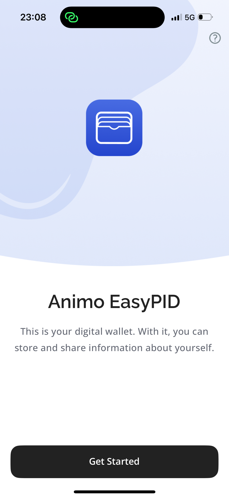
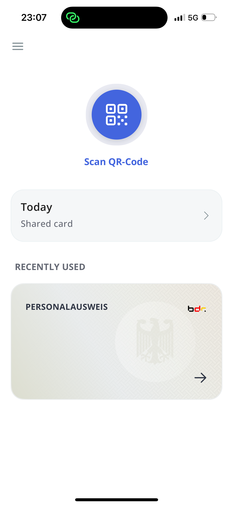
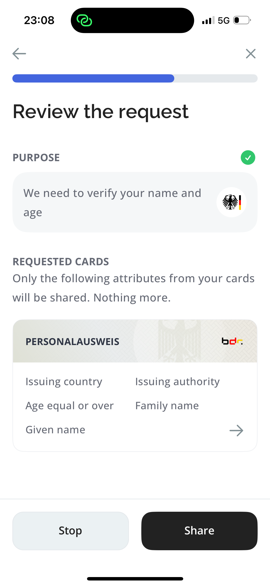

   

<h1 align="center"><b>Paradym Wallet</b></h1>

This is the Expo React Native application for the [Paradym Wallet](https://paradym.id/products/paradym-mobile-wallet). Most feature code lives in the shared [`packages/app`](../../packages/app) package; this app contains the native configuration, app entry, and routing.

  
  
  

<i>Impression of the Paradym Wallet</i>

## Development

See the [repository README](../../README.md) for instructions on installing dependencies, creating a development build, and releasing.
