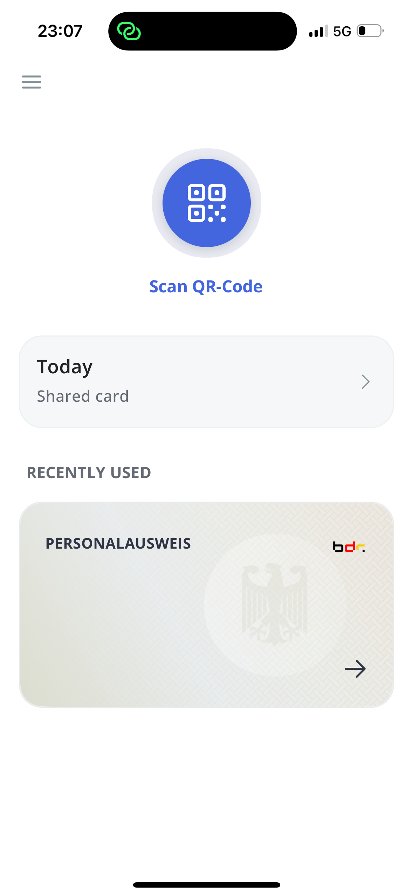
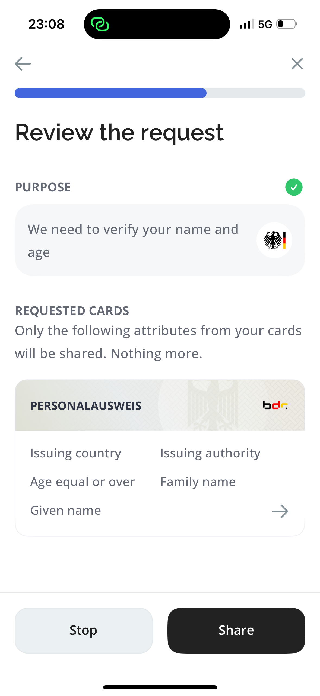

   

<h1 align="center"><b>Animo EasyPID</b></h1>

  <a href="#install">Install</a> 
  &nbsp;|&nbsp;
  <a href="#features">Features</a> 
  &nbsp;|&nbsp;
  <a href="#test">Test</a>
  &nbsp;|&nbsp;
  <a href="#project-structure">Project Structure</a>
  &nbsp;|&nbsp;
  <a href="#tech-stack">Tech Stack</a>
  &nbsp;|&nbsp;
  <a href="#known-bugs">Known Bugs</a>
  &nbsp;|&nbsp;
  <a href="#changelog">Changelog</a>

---

This app was created by [Animo Solutions](https://animo.id/) in the context of the [SPRIN-D Funke ‘EUDI Wallet Prototypes’](https://www.sprind.org/en/challenges/eudi-wallet-prototypes/). It serves as a prototype for future wallet providers and can be tested/used with our [Funke playground environment](https://funke.animo.id/). For more information on the project reach out to <ana@animo.id>. 

  
   
  

 
<i>Impression of the EasyPID Wallet</i>
 

## Install

The prototype app is currently published privately to select parties. If you're a tester for the SPRIN-D Funke project, you should have received the details on installing the app (either directly or via the guidebook). If not, please reach out to us at ana@animo.id.

## Features
The identity wallet contains the following features, you can see the full flow without running the app in the video walkthrough (will be added next week):

**General App**
- 🟢 Onboard user
  - 🟢 Set up PIN
  - 🟢 Set up biometrics
  - 🟢 Accept privacy policy
  - 🟢 Onboarding instruction
  - 🟢 Skippable identity instruction
- 🟢 Home screen
- 🟢 Activity
- 🟢 About the app
- 🟢 Credential overview
- 🔴 Support for translation files

**Credential Management**
- 🟢 Credential detail
- 🟢 Delete QEAA
- 🟠 SD-JWT VC Type Metadata
   - Resolved and base is used, but not claim metadata or SVG template yet
- 🟠 Revocation SD-JWT VC
- 🔴 Revocation Mdoc

**Obtain PID from PID provider**
- 🟢 SD JWT VC using OpenID4VCI 
- 🟢 Mdoc using OpenID4VCI 
- 🟢 [C option](https://gitlab.opencode.de/bmi/eudi-wallet/eidas-2.0-architekturkonzept/-/blob/main/architecture-proposal.md#preliminary-assessment-and-comparison-of-pid-design-options)
- 🟢 [C' option](https://gitlab.opencode.de/bmi/eudi-wallet/eidas-2.0-architekturkonzept/-/blob/main/architecture-proposal.md#preliminary-assessment-and-comparison-of-pid-design-options)
- 🟢 [B' option](https://gitlab.opencode.de/bmi/eudi-wallet/eidas-2.0-architekturkonzept/-/blob/main/architecture-proposal.md#preliminary-assessment-and-comparison-of-pid-design-options) *temporarily disabled*
- 🟢 Receive the PID from inside of the wallet
- 🟠 PID refresh (can refresh PID as long as refresh token is valid)
   - Missing re-receive the PID based on eID card

**Obtain (Q)EAAs from issuer**
- 🟢 SD-JWT VC using OpenID4VCI
- 🟢 mDOC using OpenID4VCI
- 🟢 PID presentation during (Q)EAA issuance
- 🟠 Batch issuance and single-use credentials
   - Implemented fully for PID. For non-PID: when the batch is gone the same credential is continually used
- 🟢 Authorization code flow
- 🔴 Client attestations

**Present attestations remotely** 
- 🟢 PID SD-JWT VC using OpenID4VP
- 🟢 PID mDOC using OpenID4VP
- 🟢 QEAA SD JWT VC using OpenID4VP
- 🟢 QEAA Mdoc using OpenID4VP
- 🟢 Combined presentations
- 🟢 Cross-device QR flow
- 🟢 Same-device flow
- 🟢 SD-JWT OID4VC conformance test suite
- 🟢 mDOC OID4VC conformance test suite 
- 🟢 New VP query language

**Present attestations in-person**
- Android
  - 🟢 Android-Android QR for device engagement
  - 🟢 Android-Android NFC for device engagement
  - 🔴 SD-JWT VC using OpenID4VP over BLE
  - 🟢 mDOC over BLE
- iOS
  - 🔴 SD-JWT VC using OpenID4VP over BLE
  - 🔴 mDOC over BLE

**HSM**
  - 🟢 On device HSM
  - 🟢 Cloud-backed HSM

**Trust Establishment using OpenID Federation Draft 40**
- 🟢 Issuer and verifier entity configuration
- 🟢 Verifier e2e flow 
- 🔴 Issuer e2e flow 
- 🔴 Wallet in the OpenID Federation

**Other**
- 🟠 HAIP compliance
  - Missing `verifier_attestation` and wallet attestations
- 🟠 WCAG 2.2 compliance
    - Missing keyboard accessibility for Android
- 🟠 AI-based oversharing detection
  - Using cloud based AI model

**[Test issuer/verifier](https://funke.animo.id/)** 

- 🟢 Issue QEAAs
- 🟢 Verify PID
- 🟢 Verify mixed PID-QEAA requests

## Test

Here are some resources and tips that might be helpful while testing the app.

### Development Features

The identity wallet contains the following temporary features for development and testing:

- Use a simulated eID test card. 
  - During onboarding: 
    - First PIN: enter your desired PIN
    - Pin re-enter: enter PIN 276536 (BROKEN). You will be notified the eID simulator card is activated
  - Setup later:
    - First PIN: enter PIN 276536 (BROKEN). You will be notified the eID simulator card is activated, and prompted to enter your real PIN now.
- Reset the wallet
  - Go to the menu and choose 'reset wallet'
- Toggle Cloud HSM / Secure Enclave
  - During PID retrieval (either during onboarding or setup later) there is a icon of a cloud. You can press this to toggle between Cloud HSM (default), and on-device Secure element (indicated by phone icon).

### Test flows

The [playground](https://funke.animo.id/) functions as a test relying party and/or test (Q)EAA issuer. The playground enables you to select different flows for issuing and verifying credentials. It will display a QR code and relevant information for testing and debugging.

To make sure you test all the flows, please reference the overview below.

- Overasking warnings (AI/LLM) - [UC-1](#uc-1---rent-a-car), [UC-2](#uc-2---open-a-bank-account)
- Mixed Credential request - [UC-1](#uc-1---rent-a-car), [UC-2](#uc-2---open-a-bank-account)
- Multiple Credential request - [UC-1](#uc-1---rent-a-car), [UC-2](#uc-2---open-a-bank-account)
- Only PID verification - [UC-3](#uc-3---government-identification)
- Only QEAA verification - [UC-4](#uc-4---get-an-e-prescription)
- DIF PEX - [UC-1](#uc-1---rent-a-car), [UC-2](#uc-2---open-a-bank-account), [UC-3](#uc-3---government-identification)
- DCQL - [UC-1](#uc-1---rent-a-car), [UC-2](#uc-2---open-a-bank-account), [UC-4](#uc-4---get-an-e-prescription)
- OpenID Federation - All
- Android In person / Proximity flow, [UC-5](#uc-5---proximity-flow)
- Presentation during issuance [C-1](#c-1---mdl--führerschein)
- Authorization code flow [C-4](#c-4---health-id--gesundheitskarte), [C-1](#c-1---mdl--führerschein)
- Pre authorized code flow, [C-2](#c-2---residence--meldebestätigung), [C-3](#c-3---tax-id--steuer-id)

#### Issuer

##### C-1 - mDL / Führerschein

Showcases:
- SD-JWT and mDOC
- Presenting PID during issuance

##### C-2 - Residence / Meldebestätigung

- SD-JWT and mDOC
- Pre-authorized code flow with transaction code (PIN)

##### C-3 - Tax ID / Steuer-ID

- SD-JWT and mDOC
- Pre-authorized code flow without transaction code

##### C-4 - Health ID / Gesundheitskarte

- SD-JWT and mDOC
- Authorization code flow with external browser sign-in

#### Verifier

All verifier flows can work with either OpenID Federation or X.509 certificates. You can choose this in the selection menu. 

##### UC 1 - Rent a car

Rent a car through TurboKeys or CheapCars.

> This use case requires you to have the PID and a Führerschein (drivers licence) in your wallet. 

It showcases:
- Requesting multiple credentials in one request
- Requesting mixed credentials (SD-JWT / MDOC) in one request
- The two different supported Query languages: DIF PEX and DCQL 
- Support for trust federations - CheapCars does not have any trusting entities, while TurboKeys does
- Smart AI warnings - CheapCars shows an over-asking warning to the user, while Turbokeys shows that it passes the overasking detection with a green mark.
- Single use credentials (every time a new credential will be presented as long as the batch lasts).

##### UC 2 - Open a bank account

Open a bank account at Open Horizon Bank

> This use case requres you to have the PID, Steur-ID, meltebestatigung and Gezundheidskarte

It showcases:
- Requesting multiple credentials in one request
- The DIF PEX query language
- Support for trust federations - several entities trust Open Horizon Bank. Because Europe trusts Open Horizon, it is also trusted by die Bundesregierung. 
- Smart AI warnings - Open Horizon Bank shows an over-asking warning to the user.
- Single use credentials (every time a new credential will be presented as long as the batch lasts).

#####  UC 3 - Government identification

> This use case requires you to have the PID.

It showcases:
- Requesting only the PID
- The two different supported Query languages: DIF PEX and DCQL 
- Support for trust federations - Die Bundesregierung is trusted by Europe
- Single use credentials and backgroud PID referesh (every time a new credential will be presented, which can be seen in the playground).

##### UC 4 - Get an e-prescription

Get an e-prescription from Redcare Pharmacy

> This use case requires you to have the Gezundheidskarte (health card)

It showcases:
- Requesting only a QEAA
- The DCQL query language
- Support for trust federations - Redcare Pharmacy is trusted by several entities. Both Redcare and TurboKeys are trusted by the KvK entity.
- Single use credentials (every time a new credential will be presented as long as the batch lasts).

##### UC 5 - Proximity Flow

Present mDOC credential in person.

> This use case requires you to have:
>  - Two android devices (one with wallet, one with verifier)
>  - Führerschein mDL (drivers licence) in your wallet
>  - Android verifier application (download `appverifier-debug.apk` from this [Github release](https://github.com/animo/paradym-wallet/releases/tag/v1.6.0) on android device, and install the APK).

It showcases:
- Requesting mDOC in person
- Requesting only a QEAA
- Single use credentials (every time a new credential will be presented as long as the batch lasts). 

How to:
- Verifier:
  - Open the verifier application and select either **older than 18**, or **older than 21**, or make a custom request (but make sure to only request from the base mDL propertiess, as the mDL issued currently does not include AAMVA related attributes).
- Wallet
  - Press "Scan QR-Code", then "Show my QR Code", enable permissions (Bluetooth and location, some devices require you to do this in the app settings, after which you may have to restart the app).
- Connect:
  - NFC: Tap the two devices against each other (make sure the NFC chips on the devices align)
  - QR: Scan the wallet QR code with the verifier application
  - Both: Select in the verifier app whether it should use Peripheral or Central mode (both work)
- Wallet
  - It should now redirect to the proof sharing screen alowing you to share the requested attributes
- Verifier
  - Once the wallet has shared the attributes it will show the attributes in the verifier app.

### Device Compatibility

#### Android

This app requires devices with:

- Android 8+
- Hardware Security Module (HSM)
- Biometric support (e.g., fingerprint sensor, face recognition)

Android devices without these features will not be able to run the app.

#### iOS

Compatible with iPhone 5s and later models. This app requires devices with:
- iOS 14+

## Project Structure

The EasyPID wallet is part of a larger monorepo. The EasyPID app is located in the [apps/easypid](apps/easypid) directory.

### EasyPID App

This is the actual EasyPID application. It is built using Expo and React Native.

The app uses file-based routing starting in the [`src/app`](src/app) directory. Each file in this directory is a route within the app. 

E.g. ['src/app/authenticate.tsx'](src/app/authenticate.tsx) is the entry point for the authentication screen.

Initially when the app is opened, the [`src/app/(app)/_layout.tsx`](src/app/(app)/_layout.tsx) is rendered. This is the main layout for the app. If the wallet is not unlocked, the user is redirected to the onboarding (on first launch) or authentication screen (on return).

### Agent

The agent contains the digital identity related wallet functionality. It uses a [Credo](https://github.com/openwallet-foundation/credo-ts) agent instance to manage the wallet.

[Aries Askar](https://github.com/hyperledger/aries-askar) is used for cryptographic operations and encrypted storage of the wallet data. 

[Expo Secure Environment](https://github.com/animo/expo-secure-environment) is used to provide support for cryptographic operations using the device's secure environment (HSM, SE, etc.) hidden behind biometric authentication.

Some relevant links:
- [Handling invitations](../../packages/agent/src/invitation/handler.ts) - this is the entry point for most interactions in the app that need to use the agent. E.g receiving and sharing credentials

### Secure Unlock

The secure store package located in [`packages/secure-store`](packages/secure-store) contains logic for secure unlocking and initializing of the wallet. It uses [React Native Keychain](https://github.com/oblador/react-native-keychain) under the hood, which integrates with the device's secure APIs for storing sensitive data.

It also contains the logic for deriving the wallet's master key from the user PIN (using KDF). Whenver the wallet is opened, the PIN is required to unlock the wallet.

Alternatively, the derive PIN can be stored in the device's keychcain, allowing the user to retrieve the master key from the keychain and unlock the wallet directly.

Relevant links:
- [Secure Unlock Provider](../../packages/secure-store/secure-wallet-key/SecureUnlockProvider.tsx) - the main entry point for secure unlocking and initialization of the wallet

### App / UI Package

The [app package](packages/app) and [ui package](packages/ui) contain the underlying app UI and screens logic. This code is shared between our existing [Paradym Wallet](apps/paradym) also located in this repository. This allows us to reuse base elements, while still providing custom screens and UI elements in each of the applications.

### Wallet Service Provider

The Wallet Service Provider (WSP) is a separate service that allows creating and signing with hardware based keys. The Wallet Service Provider currently uses Google Cloud HSM, and creates a separate key ring for each wallet. A wallet communicates to the Wallet Service Provider based on a key dervied from a salt and PIN.

In the future this will be updated to also include a key attested by Google Play Integrity or Apple App Attest Service, ensuring the WSP is actually interacting with an instance of the EasyPID wallet, and keys are generated in the wallet. The service also allows issuance of Wallet Attestations, but these are not leveraged in the EasyPID yet, and the keys are also not verified by the Google Play Integrity or Apple App Attest Service.

Wallet Service Provider Implementation: https://github.com/animo/funke-wallet-provider

### Documentation

The [documentation](./documentation/) folder currently contains only the overview of the WCAG 2.2 accessibility compliance status with the accompanying todo's for next steps on accessibility. 

### PID Options

The C/C' flow supported in the Paradym Wallet is mostly implemented in [Credo](https://github.com/openwallet-foundation/credo-ts).

## Tech stack

The following section lists the software components used to create the EasyPID wallet. The heavy lifting is done by [Credo](https://github.com/openwallet-foundation/credo-ts). The most notable dependencies consumed by Credo are the [OpenID4VCI](https://github.com/animo/oid4vc-ts), [OpenID4VP](https://github.com/Sphereon-Opensource/OID4VC), [OpenID Federation](https://github.com/animo/openid-federation-ts), [Mdoc](https://github.com/animo/mdoc) and [SdJwt](https://github.com/openwallet-foundation-labs/sd-jwt-js) libraries. Other notable dependencies include the Animo [Expo Secure Environment](https://github.com/animo/expo-secure-environment), which provides support for cryptographic operations using the device's secure environment (HSM, SE, etc.) hidden behind biometric authentication, and Animo [Ausweis Sdk](https://github.com/animo/expo-ausweis-sdk) for automatic setup and configuration of the Ausweis SDK for iOS and Android in Expo apps.

- [Credo](https://github.com/openwallet-foundation/credo-ts)
  - [OpenID4VCI](https://github.com/animo/oid4vc-ts)
  - [OpenID4VP](https://github.com/Sphereon-Opensource/OID4VC)
  - [Mdoc](https://github.com/animo/mdoc)
  - [SdJwt](https://github.com/openwallet-foundation-labs/sd-jwt-js)
  - [DCQL](https://github.com/auer-martin/dcql)
  - [OpenID Federation](https://github.com/animo/openid-federation-ts)
- [Expo Secure Environment](https://github.com/animo/expo-secure-environment)
- [Expo Mdoc Data Transfer](https://github.com/animo/expo-mdoc-data-transfer)
  - Based on EUDI Reference Implementation
- [Ausweis Sdk](https://github.com/animo/expo-ausweis-sdk)
- [Wallet Service Provider Implementation](https://github.com/animo/funke-wallet-provider)

The following standards and specifications were implemented.

- 🟢 [OpenID for Verifiable Credential Issuance - ID 1 / Draft 14](https://openid.net/specs/openid-4-verifiable-credential-issuance-1_0-14.html)
- 🟢[OpenID for Verifiable Presentations - Draft 20](https://openid.net/specs/openid-4-verifiable-presentations-1_0-20.html)
   - Supports DCQL from draft 22
- 🟢 [SD-JWT VC - Draft 3](https://www.ietf.org/archive/id/draft-ietf-oauth-sd-jwt-vc-03.html)
- 🟢 [Self-Issued OpenID Provider V2 - Draft 13](https://openid.net/specs/openid-connect-self-issued-v2-1_0-13.html)
- 🟢 [ISO 18013-5](https://www.iso.org/standard/69084.html)
- 🟢 [ISO/IEC TS 18013-7 DTS Ballot Text](https://www.iso.org/standard/82772.html)
- 🟡 [High Assurance Interop Profile - Draft 0](https://openid.net/specs/openid4vc-high-assurance-interoperability-profile-sd-jwt-vc-1_0-00.html)
  - Missing `verifier_attestation` and wallet attestation
- 🟠 [OpenID Federation - Draft 40](https://openid.net/specs/openid-federation-1_0-40.html)

## Known Bugs

- Entering incorrect PIN during presentation sharing will get stuck on the PIN loading screen (it does show correct PIN invalid toast).
- You have to force close the app when you use BLE for the first time after enabling location permission because the permission popup does not go away.
- Installing the latest version of the app if you had a previous version of the application can cause you to get stuck in a broken state, even if the application is removed and reinstalled.

## Changelog

### Phase 2

#### 04-12-2024

**Wallet**
- Fixed an issue where the PID setup would get stuck if you skipped it during onboarding [commit](https://github.com/animo/openid4vc-playground-funke/commit/65178e776bc421b9ca413542ea0e86db4ad1ead4)

#### 28-11-2024

**Playground**
- Changed text "Requires PIN" to "Requires transaction code"
- Allow additional options for requesting mixed sd-jwt vc and mso_mdoc requests using DCQL [commit](https://github.com/animo/openid4vc-playground-funke/commit/2c2089f5e77227f592116e6af397b063acda67af)

#### 27-11-2024

**Readme**
- Extended this README document with additional testing information.
- Added [Known Bugs](#known-bugs) section.
- Replaced screenshot in readme
- Added a section about the Wallet Service Provider

**Wallet**
- Fixed an issue with the app locking in the background [commit](https://github.com/animo/paradym-wallet/commit/6d5e2f176d32328e834b293c3389780fd9ca3d91)
- Fixed an issue where deeplinking didn't work on iOS if the wallet is already unlocked [commit](https://github.com/animo/paradym-wallet/commit/db12085d4c67e6688aa2f975d05783253eb06b5d)

### Phase 1

#### 02-09-2024

- Redeployed test relying party to add a "Open in Wallet" button for same device flow ([commit](https://github.com/animo/openid4vc-playground-funke/commit/9a839521e8d70aaf92b7fa03fa037fc866644ad0))
