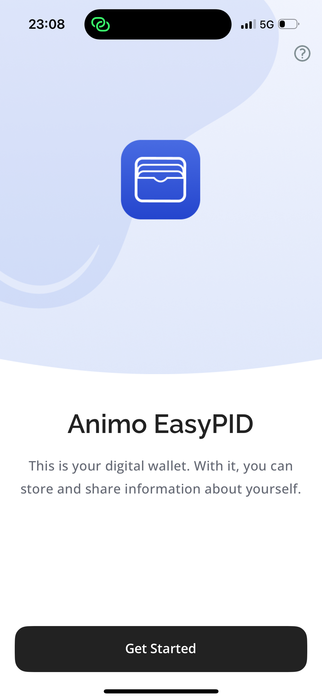

<div align="center">
   
</div>

<h1 align="center"><b>Animo EasyPID</b></h1>

This app is an implementation of a mobile EUDI wallet protoype.

This app was created by [Animo Solutions](https://animo.id/) in the context of the [SPRIN-D Funke ‘EUDI Wallet Prototypes’](https://www.sprind.org/en/challenges/eudi-wallet-prototypes/). It serves as a prototype for future wallet providers. For more information on the project reach out to <ana@animo.id>.

During the project an identity wallet and a test relying party was delivered.

The identity wallet contains the following features:

- Onboard user
- Set up PIN
- Set up biometrics
- Authentication using biometrics or PIN
- Obtain PID from PID provider ([C option](https://gitlab.opencode.de/bmi/eudi-wallet/eidas-2.0-architekturkonzept/-/blob/main/architecture-proposal.md))
- Obtain PID from PID provider ([B' option](https://gitlab.opencode.de/bmi/eudi-wallet/eidas-2.0-architekturkonzept/-/blob/main/architecture-proposal.md))
- Present attestations remotely using cross-device QR flow
- Present attestations remotely using same-device flow
- About the app

The identity wallet contains the following temporary features for development and testing:

- Switch between C and B' PID flow
- Reset wallet


 <div align="center">
  
   
  
</div>

 <p align="center"><i>Impression of the EasyPID Wallet</i></p> 

## Install


## Try it out

Here's some resources and tips that might be helpful while testing the app.

### Before you start

- Make sure you are have access to the BDR PID issuer which is behind a firewall
- Have an eID card ready
- Have the [test relying party](https://funke.animo.id/) ready
    - The test relying party enables you to select a credential type and request type to verify the PID credential. 
    - It will display a QR code as well as relevant information, 

### Device Compatibility

#### Android

This app requires devices with:

- Hardware Security Module (HSM)
- Biometric support (e.g., fingerprint sensor, face recognition)

Android devices without these features will not be able to run the app.

#### iOS

Compatible with iPhone 5s and later models.

### While testing

- The very first screen has an option to switch between the C and B' flow for testing purposes. It is located on the left side besides the continue button.
- There is an option to reset the wallet during testing. It is located in the menu, which you can find on the home page.

## Project Structure

The EasyPID wallet is part of a larger monorepo. The EasyPID app is located in the [apps/easypid](apps/easypid) directory.

### EasyPID App

This is the actual EasyPID application. It is built using Expo and React Native.

The app uses file-based routing starting in the [`src/app`](src/app) directory. Each file in this directory is a route within the app. 

E.g. ['src/app/authenticate.tsx'](src/app/authenticate.tsx) is the entry point for the authentication screen.

Initially when the app is opened, the [`src/app/(app)/_layout.tsx`](src/app/(app)/_layout.tsx) is rendered. This is the main layout for the app. If the wallet is not unlocked, the user is redirected to the onboarding (on first launch) or authentication screen (on return).

### Agent

The agent contains the digital identity related wallet functionality. It uses an [Credo](https://github.com/openwallet-foundation/credo-ts) agent instance to manage the wallet.

[Aries Askar](https://github.com/hyperledger/aries-askar) is used for cryptographic operations and encrypted storage of the wallet data. 

[Expo Secure Environment](https://github.com/animo/expo-secure-environment) is used to provide support for cryptographic operations using the device's secure environment (HSM, SE, etc.) hidden behind biometric authentication.

Some relevant links:
- [Handling invitations](../../packages/agent/src/invitation/handler.ts) - this is the entry point for most interactions in the app that need to use the agent. E.g receiving and sharing credentials

### Secure Unlock

The secure store package located in [`packages/secure-store`](packages/secure-store) contains logic for secure unlocking and initializing of the wallet. It uses [React Native Keychain](https://github.com/oblador/react-native-keychain) under the hood, which integrates with the device's secure APIs for storing sensitive data.

It also contains the logic for deriving the wallet's master key from the user PIN (using KDF). Whenver the wallet is opened, the PIN is required to unlock the wallet.

Alternatively, the derive PIN can be stored in the device's keychcain, allowing the user to retrieve the master key from the keychain and unlock the wallet directly.

Relevant links:
- [Secure Unlock Provider](../../packages/secure-store/secure-wallet-key/SecureUnlockProvider.tsx) - the main entry point for secure unlocking and initialization of the wallet

### App / UI Package

The [app pacakge](packages/app) and [ui pacakge](packages/ui) contain the underlying app UI and screens logic. This code is shared between our existing [Paradym Wallet](apps/paradym) also located in this repository. This allows us to reuse base elements, while still providing custom screens and UI elements in each of the applications.

### PID Options

The C flow supported in the Pardaym Wallet is mostly implemetned in Credo, the underlying identity framework we use. 

For the B' flow, more custom work was needed and this is implemented in the following files:
- [src/crypto/bPrime.ts](src/crypto/bPrime.ts)
- [src/crypto/aes.ts](src/crypto/aes.ts)

The crypto for the B' flow is implemented using Aries Askar.

## Tech stack / base components

The following section lists the software components used to create the EasyPID wallet. The heavy lifting is done by [Credo](https://github.com/openwallet-foundation/credo-ts). The most notable dependencies consumed by Credo are the [OpenId4Vc](https://github.com/Sphereon-Opensource/OID4VC) [Mdoc](https://github.com/Sphereon-Opensource/mdoc-cbor-crypto-multiplatform) and [SdJwt](https://github.com/openwallet-foundation-labs/sd-jwt-js) libraries. Other notable dependencies include the Animo [Expo Secure Environment](https://github.com/animo/expo-secure-environment), which provides support for cryptographic operations using the device's secure environment (HSM, SE, etc.) hidden behind biometric authentication, and Animo [Ausweis Sdk](https://github.com/animo/expo-ausweis-sdk) for automatic setup and configuration of the Ausweis SDK for iOS and Android in Expo apps.

- [Credo](https://github.com/openwallet-foundation/credo-ts)
  - [OpenId4Vc](https://github.com/Sphereon-Opensource/OID4VC)
  - [Mdoc](https://github.com/Sphereon-Opensource/mdoc-cbor-crypto-multiplatform)
  - [SdJwt](https://github.com/openwallet-foundation-labs/sd-jwt-js)
- [Expo Secure Environment](https://github.com/animo/expo-secure-environment)
- [Ausweis Sdk](https://github.com/animo/expo-ausweis-sdk)

The following standards and specifications were implemented.

- [OpenID for Verifiable Credential Issuance - ID 1 / Draft 13](https://openid.net/specs/openid-4-verifiable-credential-issuance-1_0-ID1.html)
- [OpenID for Verifiable Presentations - Draft 20](https://openid.net/specs/openid-4-verifiable-presentations-1_0-20.html)
- [SD-JWT VC - Draft 3](https://www.ietf.org/archive/id/draft-ietf-oauth-sd-jwt-vc-03.html)
- [Self-Issued OpenID Provider V2 - Draft 13](https://openid.net/specs/openid-connect-self-issued-v2-1_0-13.html)
- [ISO 18013-5](https://www.iso.org/standard/69084.html)
- [ISO/IEC TS 18013-7 DTS Ballot Text](https://www.iso.org/standard/82772.html)
- [High Assurance Interop Profile - Draft 0](https://openid.net/specs/openid4vc-high-assurance-interoperability-profile-sd-jwt-vc-1_0-00.html)
- ❌ [OpenID Federation - Draft 34](https://openid.net/specs/openid-federation-1_0-34.html)

## 🏁 Start a wallet

<!-- First, start by installing all dependencies by running `pnpm install`.

Once all dependencies are installed, you need to make sure you have a development build of the app on your mobile device.
You can install this using the following commands:

```sh
cd apps/easypid
pnpm prebuild
pnpm ios # or android
```

You only need to install the development build when **native** dependencies change. If you're only working on JS, you can skip this step if you already have the development build installed.

Once installed you can run `pnpm start` from the root of the project to start your development server. -->

<!-- ## 🆕 Add new dependencies

### Pure JS dependencies

If you're installing a JavaScript-only dependency that will be used across platforms, install it in `packages/app`:

```sh
cd packages/app
pnpm add date-fns
cd ../..
pnpm
```

### Native dependencies

If you're installing a library with any native code, you must install it in `expo`:

```sh
cd apps/paradym
pnpm add react-native-reanimated
cd ..
pnpm
```

You can also install the native library inside of `packages/app` if you want to get autoimport for that package inside of the `app` folder. However, you need to be careful and install the _exact_ same version in both packages. If the versions mismatch at all, you'll potentially get terrible bugs. This is a classic monorepo issue. You can use `lerna-update-wizard` to help with this (you don't need to use Lerna to use that lib). -->
